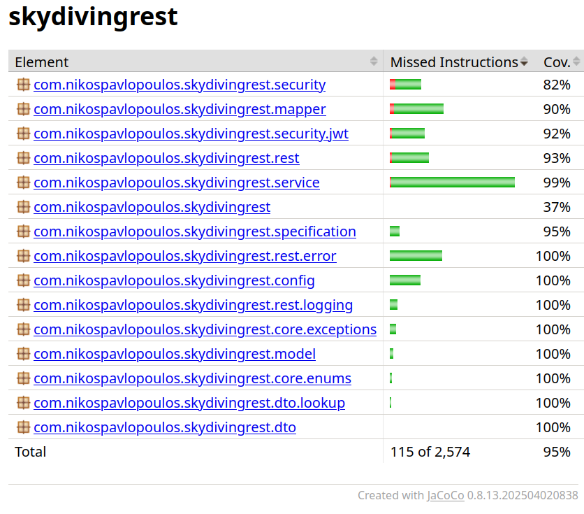

# Skydiving Logbook REST API

A RESTful API for tracking skydiving jumps, managing user accounts, and handling related static data like aircraft, dropzones, and jump types. Built with Spring Boot, it includes JWT-based security, CRUD operations, search functionality, and a basic frontend for user interaction. The project is structured as a monorepo, with the backend in `src` and the frontend in `frontend-app`. The core work of the backend is complete, while the frontend is a work in progress.

## Features

- User authentication and management (registration, login, profile update, password change).
- Jump logging with details like jump number (dynamically calculated), altitude, freefall duration, date, notes, aircraft, dropzone, and jump type.
- Static data lookups for aircraft, dropzones, and jump types (pre-populated via SQL scripts).
- Dashboard stats: Total jumps, total freefall time, sortable/paginated jump list with actions (create, edit, delete).
- Role-based access (user/admin via Role enum).
- Search and pagination for jumps with filters (user, date range, jump type) using JPA specifications.
- Error handling with custom exceptions and standardized JSON responses.
- Frontend forms for login, registration, jump creation, and dashboard display.


## Tech Stack

- **Backend**: Java 21, Spring Boot, Spring Data JPA, Hibernate, Spring Security, JWT.
- **Build Tool**: Gradle (dependencies include spring-boot-starter-web, spring-boot-starter-data-jpa, spring-boot-starter-security, mysql-connector-java, h2-database, jjwt, lombok, mapstruct).
- **Database**: MySQL (development), H2 (testing).
- **Security**: Spring Security with JWT authentication (custom filter, service, entry point).
- **Testing**: Spring Boot Integration Tests, JUnit 5, Mockito, JaCoCo for coverage.
- **Frontend**: Vanilla HTML, JavaScript, CSS.
- **Other**: MapStruct for entity-DTO mapping, JPA specifications for queries, logging interceptor, Jackson for JSON serialization, CORS configuration.

## Planned Milestones

- Integrate Swagger/OpenAPI for API documentation.
- Add Docker support for containerization and deployment.

## Installation

1. Clone the repository:
   ```
   git clone https://github.com/nikospavlopoulos/skydivinglogbook-spring-rest.git
   ```

2. Set up the database:
    - For development: Install MySQL, create a database (e.g., skydivingdb), update `application.properties` or `application-dev.properties` with credentials (e.g., `spring.datasource.url=jdbc:mysql://localhost:3306/skydivingdb`).
    - For testing: H2 is in-memory, no setup needed.
    - Run initialization scripts from `src/main/resources/sql` to populate static data (aircraft, dropzones, jump types) and optional test jumps.

3. Build the backend & Run the application:
   ```
   ./gradlew build && ./gradlew bootRun
   ```

## Running the Application

- **Backend**:
    - Run with Gradle: `./gradlew bootRun`.
    - Access at `http://localhost:8080`.
    - H2 console: `http://localhost:8080/h2-console` (for development/testing).

- **Frontend**:
    - Open `frontend-app/` in a code editor like VS Code.
    - Use the Live Server extension to serve at `http://127.0.0.1:5500/index.html`.
    - Pages currently include login (`index.html`), registration (`register.html`), dashboard (`dashboard.html`) and jumps (`jumps.html`).

## API Endpoints

Base URL: `http://localhost:8080`.

- **Authentication**:
    - POST `/api/auth/login`: Authenticate user and return JWT (body: `AuthenticationRequestDTO` with username/password).
    - POST `/api/users`: Register user (body: `UserInsertDTO`).

- **Users**:
    - GET `/api/users/{id}`: Get user details.
    - PUT `/api/users/{id}`: Update user (body: `UserUpdateDTO`).
    - PUT `/api/users/{id}/password`: Update password (body: `PasswordUpdateDTO`).
    - DELETE `/api/users/{id}`: Delete user.

- **Jumps**:
    - GET `/api/jumps/all`: List all jumps for the user (with pagination and sorting).
    - GET `/api/jumps/{id}`: Get specific jump.
    - POST `/api/jumps`: Create jump (body: `JumpInsertDTO`).
    - PUT `/api/jumps/{id}`: Update jump (body: `JumpUpdateDTO`).
    - DELETE `/api/jumps/{id}`: Delete jump.
    - GET `/api/jumps/search`: Search jumps with filters (query params for user, date range, jump type).
    - GET `/api/jumps/totals`: Get aggregate stats (total jumps, freefall time).

- **Lookups**:
    - GET `/api/lookups/aircraft`: List aircraft.
    - GET `/api/lookups/dropzones`: List dropzones.
    - GET `/api/lookups/jumptypes`: List jump types.

Use of Postman for testing, with environments set up for authorization and JSON verification.

## Frontend Overview (Under Development)

- `index.html`: Login form, submits to `/api/auth/login`, stores JWT in localStorage.
- `register.html`: Registration form, submits to `/api/users`.
- `dashboard.html`: Displays welcome message, stats cards (total jumps, freefall time), sortable/paginated jumps table, and "Create Jump" button/form. Fetches data from `/api/jumps/all`, `/api/lookups/*`.
- `jumps.html`: Jump creation form, submits to `/api/jumps`.
- JavaScript files handle API calls, form validation, JWT parsing, and UI updates.

## Testing and Coverage

Tests cover repositories, services, controllers, security, DTO validation, and integration scenarios.

- Coverage tool: JaCoCo.

### JaCoCo & Gradle report (12/09/2025):




## Project Structure

```
skydiving-logbook-api/
├── frontend-app/                  # Standalone frontend application
│   ├── css/                       # Stylesheets
│   ├── js/                        # JavaScript files (e.g., main.js, login.js, dashboard.js)
│   ├── index.html                 # Login page
│   ├── register.html              # Registration page
│   ├── dashboard.html             # Dashboard with jumps table and Info data
│   └── jumps.html                 # Jump Creation form
├── src/
│   ├── main/
│   │   ├── java/
│   │   │   └── com/nikospavlopoulos/skydivingrest/
│   │   │       ├── config/                # Configuration classes (e.g., SecurityConfig, JacksonConfig, TimeConfig)
│   │   │       ├── core/
│   │   │       │   ├── enums/             # Enums (e.g., Role)
│   │   │       │   └── exceptions/        # Custom exceptions (e.g., GenericException, UnauthorizedException)
│   │   │       ├── dto/                   # Data Transfer Objects (e.g., UserInsertDTO, JumpInsertDTO)
│   │   │       │   └── lookup/            # Lookup DTOs (e.g., JumpLookupDTO, AircraftLookupDTO)
│   │   │       ├── mapper/                # MapStruct mappers for entity-DTO conversions
│   │   │       ├── model/                 # JPA entities (e.g., User, Jump, Aircraft, Dropzone, Jumptype)
│   │   │       ├── rest/                  # REST controllers (e.g., UserController, JumpController, LookupController)
│   │   │       │   ├── error/             # Error handling (e.g., ErrorHandler, ApiErrorResponseDTO)
│   │   │       │   └── logging/           # Request/response logging interceptor
│   │   │       ├── security/              # Security components (e.g., CustomUserDetails, JwtAuthenticationFilter)
│   │   │       │   └── jwt/               # JWT service (e.g., JwtServiceImpl)
│   │   │       ├── service/               # Business logic (e.g., UserServiceImpl, JumpServiceImpl, StaticDataServiceImpl)
│   │   │       └── specification/         # JPA specifications for search queries
│   │   └── resources/
│   │       ├── application.properties     # Configuration properties (dev/test profiles)
│   │       └── data-h2.sql / data-mysql.sql # Database initialization scripts
│   └── test/
│       └── java/                          # Tests (repositories, services, controllers, security)
├── pom.xml                                # Maven build file with dependencies
├── LICENSE                                # MIT License
└── README.md                              # This file
```


## License

MIT License. See the [LICENSE](LICENSE) file for details.