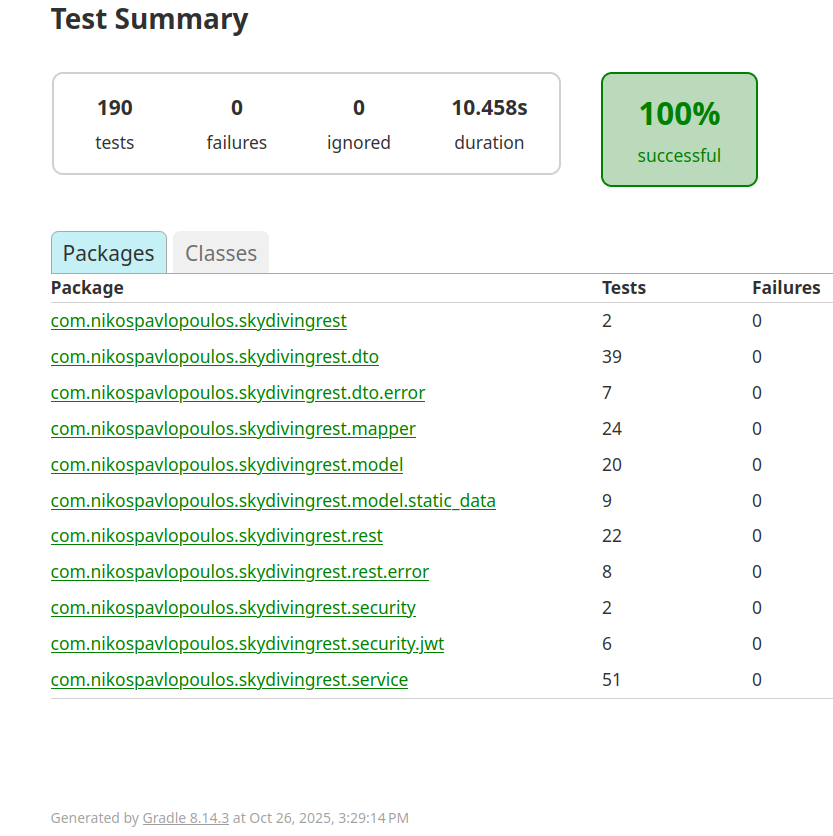

# Skydiving Logbook REST API

  
  
  [](#)
  [](#)
  [](#)
  [](#)
  
  
  


A RESTful API for tracking skydiving jumps, managing user accounts, and handling related static data like aircraft, dropzones, and jump types. Built with Spring Boot, it includes JWT-based security, CRUD operations, search functionality, and a basic frontend for user interaction. The project is structured as a monorepo, with the backend in `src` and the frontend in `frontend-app`.

## Video Demo

### For the [Video Demo click here](https://youtu.be/ddpZyq2-30Q?si=0WPRMsWgoW6kFFLE), or click on the gif below

[](https://youtu.be/ddpZyq2-30Q?si=0WPRMsWgoW6kFFLE)

## Table of Contents

1. [Skydiving Logbook REST API](#skydiving-logbook-rest-api)
2. [Goals & Scope](#goals--scope)
3. [TL;DR / What this repo contains](#tldr--what-this-repo-contains)
4. [Features](#features)
5. [Tech Stack](#tech-stack)
6. [Database Schema](#database-schema)
7. [Design Decisions & Trade-offs](#design-decisions--trade-offs)
8. [Roadmap & Future TODOs](#roadmap--future-todos)
9. [Installation](#installation)
    - [Serving options (recommended)](#serving-options-recommended)
    - [Backend Quickstart](#backend-quickstart)
    - [Frontend (recommended)](#frontend-recommended)
10. [API Endpoints](#api-endpoints)
11. [Frontend Overview](#frontend-overview)
12. [Testing and Coverage](#testing-and-coverage)
13. [Project Structure](#project-structure)
14. [License](#license)

## Goals & Scope

* **Core REST API**: Provide a robust and well-structured REST API for managing a personal skydiving logbook (users, jumps, and related stats).
* **Demo Frontend**: Include a lightweight frontend for manual testing, demoing flows, and serving as a reference for API consumption.
* **Code Quality**: Emphasize clean DTOs, clear separation of concerns, maintainable architecture, and strong test coverage.
* **Extensibility**: Design the backend so it can support future clients such as a SPA (React/Angular) and a native Android app.
* **Deployment Readiness**: Keep the project ready for containerization (Docker), cloud deployment, and integration with documentation tools (Swagger/OpenAPI).

## TL;DR / What this repo contains

* Backend: Java 21 + Spring Boot (REST API). Business logic lives under `src/main/java/com/nikospavlopoulos/skydivingrest`.
* Frontend: simple vanilla HTML/JS in `frontend-app/` used for manual demos (login, register, dashboard, jump creation). Styled and customized using Bootstrap framework and CSS.
* DB initialization scripts: `src/main/resources/sql/` (H2 and MySQL flavors). Use these to seed static lookup data and example jumps.

## Features

- User authentication and management (registration, login, profile update, password change).
- Jump logging with details like jump number (dynamically calculated), altitude, freefall duration, date, notes, aircraft, dropzone, and jump type.
- Static data lookups for aircraft, dropzones, and jump types (pre-populated via SQL scripts).
- Dashboard stats: Total jumps, total freefall time, sortable/paginated jump list with actions (create, edit, delete).
- Role-based access (user/admin via Role enum).
- Search and pagination for jumps with filters (user, date range, jump type) using JPA specifications.
- Error handling with custom exceptions and standardized JSON responses.
- Frontend forms for login, registration, jump creation, and dashboard display.


## Tech Stack

- **Backend**: Java 21, Spring Boot, Spring Data JPA, Hibernate, Spring Security, JWT.
- **Build Tool**: Gradle (dependencies include spring-boot-starter-web, spring-boot-starter-data-jpa, spring-boot-starter-security, mysql-connector-java, h2-database, jjwt, lombok, mapstruct).
- **Database**: MySQL (development), H2 (testing).
- **Security**: Spring Security with JWT-based stateless authentication.
- **Testing**: Spring Boot Integration Tests, JUnit 5, Mockito, JaCoCo for coverage.
- **Frontend**: HTML, JavaScript. Styling/customization with Bootstrap and CSS.
- **SQL**: seed scripts for H2 and MySQL in `src/main/resources/sql/`. (separate scripts to cover slight syntactic differences)
- **Other**: MapStruct for entity-DTO mapping, JPA specifications for queries, logging interceptor, Jackson for JSON serialization, CORS configuration.

## Database Schema

The database schema defines the relationships between users, jumps, aircraft, dropzones, and jump types.  
This structure ensures data consistency and supports features like dynamic jump numbering, search filters, and aggregate statistics.


## Design decisions & trade-offs

* **JWT for stateless authentication** : Chosen for simplicity and because the API is REST-first. Trade-offs: No server-side session invalidation.

* **MapStruct for DTO mapping** : Compile-time mapping reduces boilerplate and keeps service code clean. Trade-offs: Slightly steeper learning curve and handling mapping nulls/updates.

* **JPA Specifications for search** : Flexible multi-criteria queries without a separate query DSL. Trade-offs: longer code to build specs, more unit tests required to validate query behavior and edge-case ordering.

* **Separate static frontend** : Kept the frontend as a small standalone folder (`frontend-app/`) instead of packaging it into Spring Boot so the frontend can be iterated independently. Tradeoffs: extra steps to serve frontend from a different server.

## Roadmap & future TODOs

1. **Swagger/OpenAPI**: integrate automatic API documentaion and example requests & responses for each endpoint.
2. **Docker**: create a `Dockerfile` for containerization and easy deployment to different environments (local, staging, production).
3. **Enhanced Frontend**: Transition to a modern Single Page Application (SPA) using React or Angular.
4. **Android App**: Build a native Android application that consumes the existing REST API, with offline mode with local storage.

## Installation

#### Serving options (recommended)

1. **Embedded Tomcat (Spring Boot `bootRun`)** : easiest. Just run via a linux Terminal (or equivalent bash terminal in Windows).
2. **IntelliJ Ultimate + Tomcat** : convenient if you prefer the IDE-managed Tomcat deployment and want to debug in place.

#### Backend Quickstart


1. Clone the repository:
   ```
   git clone https://github.com/nikospavlopoulos/skydivinglogbook-spring-rest.git
   ```

2. Use H2 profile(`spring.profiles.active=test
` in `application.properties`) for zero-friction: the H2 scripts in `src/main/resources/sql/H2/` provide static lookup data and optional `randomjumps.sql`.

   - Use H2 console: `http://localhost:8080/h2-console` (for running the SQL scripts).


- Alternative: Set up the MySQL database:
    - For development: Install MySQL, create a database (e.g., skydivingdb), update `application.properties` or `application-dev.properties` with credentials (e.g., `spring.datasource.url=jdbc:mysql://localhost:3306/skydivingdb`).
    - Run initialization scripts from `src/main/resources/sql` to populate static data (aircraft, dropzones, jump types) and optional test jumps.

3. Build the backend & Run the application:
   ```
   ./gradlew build && ./gradlew bootRun
   ```
   
4. Embedded Tomcat serves the REST API in URL: `http://localhost:8080` — API base is `http://localhost:8080/api/` by default

#### Frontend (recommended)

1. Open `frontend-app/` in a code editor like VS Code.
2. Use the Live Server extension to serve at `http://127.0.0.1:5500/index.html`.
3. Pages currently include login (`index.html`), registration (`register.html`), dashboard (`dashboard.html`) and jumps (`jumps.html`).

## API Endpoints

Base URL: `http://localhost:8080`.

- **Authentication**:
    - POST `/api/auth/login`: Authenticate user and return JWT (body: `AuthenticationRequestDTO` with username/password).
    - POST `/api/users`: Register user (body: `UserInsertDTO`).

- **Users**:
    - GET `/api/users/{id}`: Get user details.
    - PUT `/api/users/{id}`: Update user (body: `UserUpdateDTO`).
    - PUT `/api/users/{id}/password`: Update password (body: `PasswordUpdateDTO`).
    - DELETE `/api/users/{id}`: Delete user.

- **Jumps**:
    - GET `/api/jumps/all`: List all jumps for the user (with pagination and sorting).
    - GET `/api/jumps/{id}`: Get specific jump.
    - POST `/api/jumps`: Create jump (body: `JumpInsertDTO`).
    - PUT `/api/jumps/{id}`: Update jump (body: `JumpUpdateDTO`).
    - DELETE `/api/jumps/{id}`: Delete jump.
    - GET `/api/jumps/search`: Search jumps with filters (query params for user, date range, jump type).
    - GET `/api/jumps/{*totals*}`: Get aggregate stats (total jumps, freefall time).
      - GET `/api/jumps/totaljumps`
      - GET `/api/jumps/totalfreefall`

- **Lookups**:
    - GET `/api/lookups/aircraft`: List aircraft.
    - GET `/api/lookups/dropzones`: List dropzones.
    - GET `/api/lookups/jumptypes`: List jump types.

## Frontend Overview

- `index.html`: Login form, submits to `/api/auth/login`, stores JWT in localStorage.
- `register.html`: Registration form, submits to `/api/users`.
- `dashboard.html`: Displays welcome message, stats cards (total jumps, freefall time), sortable/paginated jumps table, and "Create Jump" button/form. Fetches data from `/api/jumps/all`, `/api/jumps/{*totals*}`.
- `jumps.html`: Jump creation form, submits to `/api/jumps`.
- JavaScript files handle API calls, form validation, JWT parsing, and UI updates.
- JavaScript helpers handle API calls, form validation, JWT parsing, and UI updates:
  * `frontend-app/js/api.js` - fetch wrappers used by pages
  * `frontend-app/js/jwt.js` - JWT storage & retrieval helpers
  * `frontend-app/js/register.js` - register flow
  * `frontend-app/js/login.js` - login flow
  * `frontend-app/js/jumps.js` - jumps list operations

## Testing and Coverage

Tests cover repositories, services, controllers, security, DTO validation, and integration scenarios.

- Coverage tool: JaCoCo.

### JaCoCo & Gradle report (12/09/2025):





## Project Structure

```
skydivinglogbook-spring-rest/
├── frontend-app/                  # Standalone frontend application
│   ├── css/                       # Stylesheets
│   ├── js/                        # JavaScript files (e.g., main.js, login.js, dashboard.js)
│   ├── index.html                 # Login page
│   ├── register.html              # Registration page
│   ├── dashboard.html             # Dashboard with jumps table and Info data
│   └── jumps.html                 # Jump Creation form
├── src/
│   ├── main/
│   │   ├── java/
│   │   │   └── com/nikospavlopoulos/skydivingrest/
│   │   │       ├── config/                # Configuration classes (e.g., SecurityConfig, JacksonConfig, TimeConfig)
│   │   │       ├── core/
│   │   │       │   ├── enums/             # Enums (e.g., Role)
│   │   │       │   └── exceptions/        # Custom exceptions (e.g., GenericException, UnauthorizedException)
│   │   │       ├── dto/                   # Data Transfer Objects (e.g., UserInsertDTO, JumpInsertDTO)
│   │   │       │   └── lookup/            # Lookup DTOs (e.g., JumpLookupDTO, AircraftLookupDTO)
│   │   │       ├── mapper/                # MapStruct mappers for entity-DTO conversions
│   │   │       ├── model/                 # JPA entities (e.g., User, Jump, Aircraft, Dropzone, Jumptype)
│   │   │       ├── rest/                  # REST controllers (e.g., UserController, JumpController, LookupController)
│   │   │       │   ├── error/             # Error handling (e.g., ErrorHandler, ApiErrorResponseDTO)
│   │   │       │   └── logging/           # Request/response logging interceptor
│   │   │       ├── security/              # Security components (e.g., CustomUserDetails, JwtAuthenticationFilter)
│   │   │       │   └── jwt/               # JWT service (e.g., JwtServiceImpl)
│   │   │       ├── service/               # Business logic (e.g., UserServiceImpl, JumpServiceImpl, StaticDataServiceImpl)
│   │   │       └── specification/         # JPA specifications for search queries
│   │   └── resources/
│   │       ├── application.properties     # Configuration properties (dev/test profiles)
│   │       └── sql/                       # Database initialization scripts (H2 / MySQL)
│   └── test/
│       └── java/                          # Tests (repositories, services, controllers, security)
├── LICENSE                                # MIT License
└── README.md                              # This file
```


## License

MIT License. See the [LICENSE](LICENSE) file for details.
